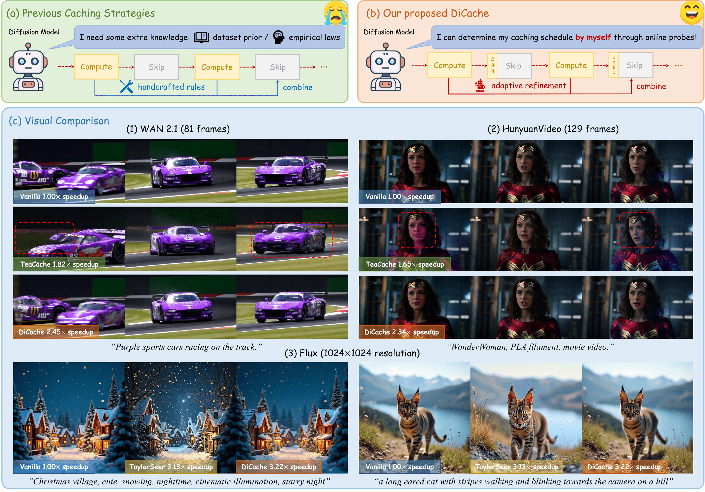
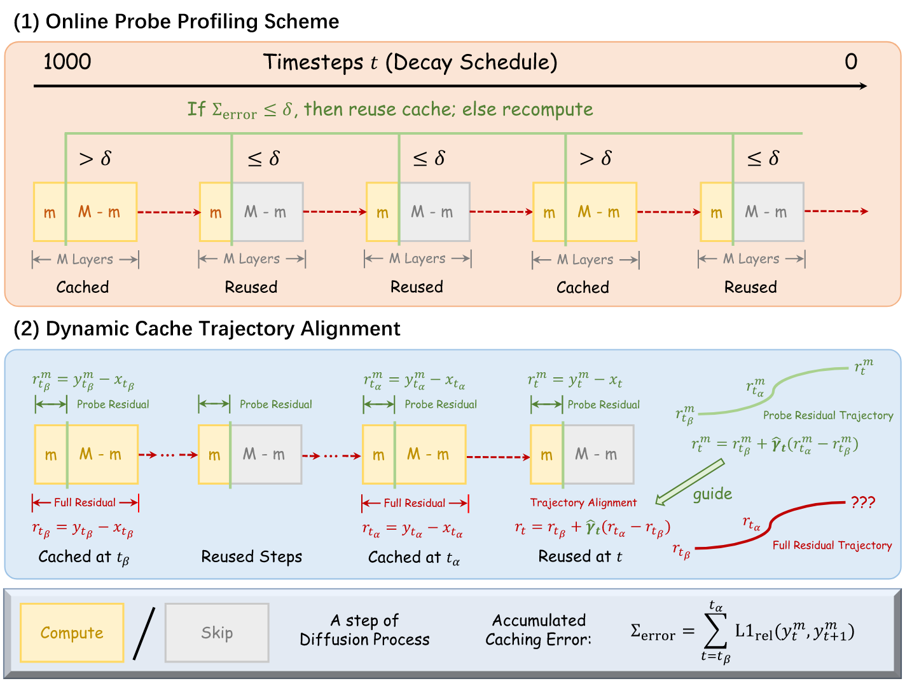

<h1>DiCache: Let Diffusion Model Determine Its Own Cache</h1>

    <a href="https://bujiazi.github.io/" target="_blank">Jiazi Bu*</a> | 
    <a href="https://github.com/LPengYang/" target="_blank">Pengyang Ling*</a> | 
    <a href="https://github.com/YujieOuO" target="_blank">Yujie Zhou*</a> | 
    <a href="https://codegoat24.github.io/" target="_blank">Yibin Wang</a>   
    <a href="https://yuhangzang.github.io/" target="_blank">Yuhang Zang</a> |
    <a href="https://wutong16.github.io/" target="_blank">Tong Wu</a> |
    <a href="http://dahua.site/" target="_blank">Dahua Lin</a> |
    <a href="https://myownskyw7.github.io/" target="_blank">Jiaqi Wang†</a>

 

    Shanghai Jiao Tong University, University of Science and Technology of China, Fudan University,   Stanford University, The Chinese University of Hong Kong, Shanghai Artificial Intelligence Laboratory

(*<b>Equal Contribution</b>)(†<b>Corresponding Author</b>)
  

 

---

<strong>DiCache is a training-free, plug-and-play adaptive caching strategy for accelerating diffusion models at runtime.</strong>

📖 Click for the full abstract of DiCache

> Recent years have witnessed the rapid development of acceleration techniques for diffusion models, especially caching-based acceleration methods. These studies seek to answer two fundamental questions: "When to cache" and "How to use cache", typically relying on predefined empirical laws or dataset-level priors to determine the timing of caching and utilizing handcrafted rules for leveraging multi-step caches. However, given the highly dynamic nature of the diffusion process, they often exhibit limited generalizability and fail on outlier samples. In this paper, a strong correlation is revealed between the variation patterns of the shallow-layer feature differences in the diffusion model and those of final model outputs. Moreover, we have observed that the features from different model layers form similar trajectories. Based on these observations, we present **DiCache**, a novel training-free adaptive caching strategy for accelerating diffusion models at runtime, answering both when and how to cache within a unified framework. Specifically, DiCache is composed of two principal components: (1) _Online Probe Profiling Scheme_ leverages a shallow-layer online probe to obtain a stable prior for the caching error in real time, enabling the model to autonomously determine caching schedules. (2) _Dynamic Cache Trajectory Alignment_ combines multi-step caches based on shallow-layer probe feature trajectory to better approximate the current feature, facilitating higher visual quality. Extensive experiments validate DiCache's capability in achieving higher efficiency and improved visual fidelity over state-of-the-art methods on various leading diffusion models including WAN 2.1, HunyuanVideo for video generation, and Flux for image generation.

## 🎨 Gallery

    

 

## 💻 Overview

    

 

DiCache consists of Online Probe Profiling Strategy and Dynamic Cache Trajectory Alignment. The former dynamically determines the caching timing with an online shallow-layer probe at runtime, while the latter combines multi-step caches based on the probe feature trajectory to adaptively approximate the feature at the current timestep

