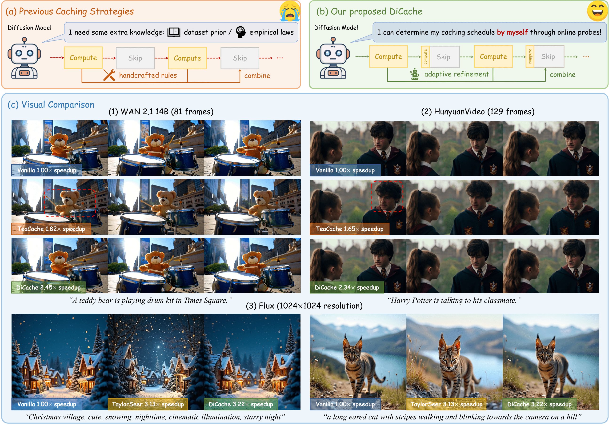

<div align="center">

<p align="center">
  
</p>

<h1>DiCache: Let Diffusion Model Determine Its Own Cache</h1>

<div>
    <a href="https://bujiazi.github.io/" target="_blank">Jiazi Bu*</a><sup></sup> | 
    <a href="https://github.com/LPengYang/" target="_blank">Pengyang Ling*</a><sup></sup> | 
    <a href="https://github.com/YujieOuO" target="_blank">Yujie Zhou*</a><sup></sup> |
    <a href="https://codegoat24.github.io/" target="_blank">Yibin Wang</a><sup></sup> <br> 
    <a href="https://yuhangzang.github.io/" target="_blank">Yuhang Zang</a><sup></sup> |
    <a href="http://dahua.site/" target="_blank">Dahua Lin</a><sup></sup> |
    <a href="https://myownskyw7.github.io/" target="_blank">Jiaqi Wang<sup>†</sup></a><sup></sup>
</div>
<br>
<div>
    <sup></sup>Shanghai Jiao Tong University, University of Science and Technology of China, Fudan University, <br> The Chinese University of Hong Kong, Shanghai Artificial Intelligence Laboratory
</div>
(*<b>Equal Contribution</b>)(<sup>†</sup><b>Corresponding Author</b>)
<br><br>

[](https://arxiv.org/abs/2508.17356) 
[](https://bujiazi.github.io/dicache.github.io/)

---

<strong>DiCache is a training-free adaptive caching strategy for accelerating diffusion models at runtime.</strong>

<details><summary>📖 Click for the full abstract of DiCache</summary>

<div align="left">

> Recent years have witnessed the rapid development of acceleration techniques for diffusion models, especially caching-based acceleration methods. These studies seek to answer two fundamental questions: "When to cache" and "How to use cache", typically relying on predefined empirical laws or dataset-level priors to determine caching timings and adopting handcrafted rules for multi-step cache utilization. However, given the highly dynamic nature of the diffusion process, they often exhibit limited generalizability and fail to cope with diverse samples. In this paper, a strong sample-specific correlation is revealed between the variation patterns of the shallow-layer feature differences in the diffusion model and those of deep-layer features. Moreover, we have observed that the features from different model layers form similar trajectories. Based on these observations, we present **DiCache**, a novel training-free adaptive caching strategy for accelerating diffusion models at runtime, answering both when and how to cache within a unified framework. Specifically, DiCache is composed of two principal components: (1) _Online Probe Profiling Scheme_ leverages a shallow-layer online probe to obtain an on-the-fly indicator for the caching error in real time, enabling the model to dynamically customize the caching schedule for each sample. (2) _Dynamic Cache Trajectory Alignment_ adaptively approximates the deep-layer feature output from multi-step historical caches based on the shallow-layer feature trajectory, facilitating higher visual quality. Extensive experiments validate DiCache's capability in achieving higher efficiency and improved fidelity over state-of-the-art approaches on various leading diffusion models including WAN 2.1, HunyuanVideo and Flux.
</details>
</div>

## 🎨 Gallery
<div style="width: 100%; text-align: center; margin:auto;">
    
</div>
<br>

## 💻 Overview
<div style="width: 100%; text-align: center; margin:auto;">
    
</div>
<br>

DiCache consists of _Online Probe Profiling Strategy_ and _Dynamic Cache Trajectory Alignment_. The former dynamically determines the caching timing with an online shallow-layer probe at runtime, while the latter combines multi-step caches based on the probe feature trajectory to adaptively approximate the feature at the current timestep. By integrating the above two techniques, DiCache answers "when" and "how" to cache for diffusion models within a unified framework.

## 🔧 Installations
### Setup repository and conda environment

```bash
git clone https://github.com/Bujiazi/DiCache.git
cd DiCache

conda create -n dicache python=3.11
conda activate dicache

pip install -r requirements.txt
```

## 🎈 Quick Start
### DiCache + FLUX
Model downloading is automatic for FLUX.
```bash
cd FLUX
python run_flux_dicache.py
```

### DiCache + HunyuanVideo
Follow [here](https://github.com/Tencent-Hunyuan/HunyuanVideo/blob/main/ckpts/README.md) to manually download model checkpoints and store them in `HunyuanVideo/ckpts`.
```bash
cd HunyuanVideo
sh run_hunyuanvideo_dicache.sh
```

### DiCache + HunyuanVideo + Sparse VideoGen
Coming Soon

### DiCache + WAN 2.1
Coming Soon

## 🖋 News
- Our Project page is released! (2025.8.30)
- Code for HunyuanVideo (V1.0) is released! (2025.8.30)
- Code for FLUX (V1.0) is released! (2025.8.28)
- Paper is available on arXiv! (2025.8.24)

## 🏗️ Todo
- [ ] 🚀 The code for WAN 2.1 is on the way!
- [x] 🚀 Release the project page
- [x] 🚀 Release DiCache for HunyuanVideo
- [x] 🚀 Release DiCache for FLUX
- [x] 🚀 Release paper

## 📎 Citation 

If you find our work helpful, please consider giving a star ⭐ and citation 📝 
```bibtex
@article{bu2025dicache,
  title={DiCache: Let Diffusion Model Determine Its Own Cache},
  author={Bu, Jiazi and Ling, Pengyang and Zhou, Yujie and Wang, Yibin and Zang, Yuhang and Wu, Tong and Lin, Dahua and Wang, Jiaqi},
  journal={arXiv preprint arXiv:2508.17356},
  year={2025}
}
```

## 📣 Disclaimer

This is official code of DiCache.
All the copyrights of the demo images and audio are from community users. 
Feel free to contact us if you would like remove them.

## 💞 Acknowledgements
The code is built upon the below repositories, we thank all the contributors for open-sourcing.
* [Flux](https://github.com/black-forest-labs/flux)
* [HunyuanVideo](https://github.com/Tencent-Hunyuan/HunyuanVideo)
* [WAN 2.1](https://github.com/Wan-Video/Wan2.1)
* [Sparse VideoGen](https://github.com/svg-project/Sparse-VideoGen)
* [TeaCache](https://github.com/ali-vilab/TeaCache)


